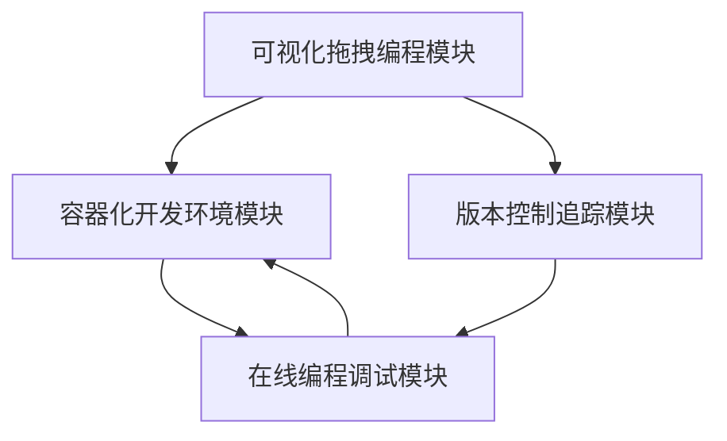

# 1 引言

## 1.1 模块设计目的

本文档旨在详细说明系统各个功能模块的具体设计方案，包括：

1. **设计范围**：对系统的四大核心模块进行详细的功能分解和接口设计。
2. **技术指导**：为后续开发阶段提供明确的技术实现指导。
3. **质量保证**：通过合理的模块划分和接口定义，确保系统的可维护性和扩展性。
4. **协作基础**：为模块间的协作和集成提供清晰的接口规范。

## 1.2 设计范围

本文档的设计范围包括：

1. **功能模块划分**：
    - 容器化开发环境模块
    - 在线编程调试模块
    - 版本控制追踪模块
    - 可视化拖拽编程模块

2. **每个模块的具体内容**：
    - 模块的功能组件和职责
    - 模块间的接口定义
    - 关键数据结构设计
    - 核心算法和处理流程
    - 错误处理机制

3. **设计重点**：
    - 模块的内聚性和独立性
    - 接口的标准化和通用性
    - 数据流转的效率和安全性
    - 系统的可扩展性和维护性

# 2 模块划分

## 2.1 模块列表概述

系统划分为以下四个核心功能模块：

1. **容器化开发环境模块**
    - 提供基于Docker的隔离开发环境
    - 管理容器生命周期和资源分配
    - 支持环境配置和依赖管理

2. **在线编程调试模块**
    - 集成Jupyter Notebook的在线IDE环境
    - 实时代码执行和调试功能
    - 日志记录和错误追踪系统

3. **版本控制追踪模块**
    - 代码版本管理（基于Git）
    - 模型版本管理（基于MLflow）
    - 数据版本管理（基于DVC）

4. **可视化拖拽编程模块**
    - 图形化工作流设计界面
    - 工作流解析和执行引擎
    - 任务状态监控和可视化

## 2.2 模块功能说明

### 2.2.1 容器化开发环境模块

1. **容器管理器**
    - **功能职责**：
        * 容器的创建、启动、停止和删除
        * 容器资源限制和隔离
        * 容器状态监控和健康检查
    - **核心组件**：
        * 容器生命周期管理器
        * 资源调度器
        * 环境配置管理器
    - **关键特性**：
        * 支持自定义镜像配置
        * 提供资源使用限制
        * 确保环境隔离性

2. **资源调度器**
    - **功能职责**：
        * CPU和内存资源分配
        * GPU资源管理（可选）
        * 负载均衡和资源监控
    - **核心组件**：
        * 资源分配算法
        * 监控数据收集器
        * 负载均衡器
    - **关键特性**：
        * 动态资源分配
        * 资源使用监控
        * 负载预警机制

### 2.2.2 在线编程调试模块

1. **Jupyter服务管理器**
    - **功能职责**：
        * Jupyter Notebook服务的启动和管理
        * 代码执行环境的配置
        * 内核状态管理
    - **核心组件**：
        * Notebook服务器
        * 代码执行器
        * 环境配置管理器
    - **关键特性**：
        * 支持多种编程语言
        * 实时代码执行
        * 交互式调试能力

2. **日志系统**
    - **功能职责**：
        * 代码执行日志记录
        * 错误信息收集
        * 运行状态监控
    - **核心组件**：
        * 日志收集器
        * 错误分析器
        * 状态监控器
    - **关键特性**：
        * 实时日志显示
        * 错误追踪和定位
        * 执行历史记录

### 2.2.3 版本控制追踪模块

1. **代码版本控制器**
    - **功能职责**：
        * 代码仓库管理
        * 版本历史记录
        * 分支管理和合并
    - **核心组件**：
        * Git管理器
        * 版本比较器
        * 冲突解决器
    - **关键特性**：
        * 版本历史追踪
        * 代码差异比较
        * 协作冲突处理

2. **模型版本管理器**
    - **功能职责**：
        * 模型参数记录
        * 训练指标追踪
        * 模型性能对比
    - **核心组件**：
        * MLflow集成器
        * 指标记录器
        * 模型比较器
    - **关键特性**：
        * 超参数记录
        * 性能指标追踪
        * 模型版本对比

3. **数据版本控制器**
    - **功能职责**：
        * 数据集版本管理
        * 数据处理流程追踪
        * 数据依赖管理
    - **核心组件**：
        * DVC集成器
        * 数据流程记录器
        * 存储管理器
    - **关键特性**：
        * 数据版本追踪
        * 处理流程记录
        * 存储空间优化

### 2.2.4 可视化拖拽编程模块

1. **工作流设计器**
    - **功能职责**：
        * 可视化界面渲染
        * 组件拖拽交互
        * 工作流验证
    - **核心组件**：
        * 图形界面渲染器
        * 交互事件处理器
        * 工作流验证器
    - **关键特性**：
        * 直观的操作界面
        * 实时连接验证
        * 参数配置界面

2. **工作流执行器**
    - **功能职责**：
        * 工作流解析
        * 任务调度执行
        * 执行状态管理
    - **核心组件**：
        * 工作流解析器
        * 任务调度器
        * 状态管理器
    - **关键特性**：
        * 任务依赖分析
        * 并行任务支持
        * 执行状态追踪

# 3 接口设计

## 3.1 模块间交互方式

### 3.1.1 REST API接口

1. **容器管理接口**
```python
# 容器生命周期管理
POST   /api/v1/containers          # 创建新容器
GET    /api/v1/containers          # 获取容器列表
GET    /api/v1/containers/{id}     # 获取容器详情
DELETE /api/v1/containers/{id}     # 删除容器
POST   /api/v1/containers/{id}/start   # 启动容器
POST   /api/v1/containers/{id}/stop    # 停止容器

# 资源管理
GET    /api/v1/resources          # 获取资源使用情况
POST   /api/v1/resources/allocate # 资源分配请求
```

2. **Jupyter服务接口**
```python
# Notebook管理
POST   /api/v1/notebooks          # 创建新的notebook
GET    /api/v1/notebooks          # 获取notebook列表
GET    /api/v1/notebooks/{id}     # 获取notebook详情
DELETE /api/v1/notebooks/{id}     # 删除notebook

# 代码执行
POST   /api/v1/notebooks/{id}/execute  # 执行代码
GET    /api/v1/notebooks/{id}/status   # 获取执行状态
```

3. **版本控制接口**
```python
# 代码版本控制
POST   /api/v1/git/commit         # 创建提交
GET    /api/v1/git/history        # 获取版本历史
POST   /api/v1/git/branch         # 创建分支

# 模型版本控制
POST   /api/v1/models            # 记录新模型版本
GET    /api/v1/models            # 获取模型列表
GET    /api/v1/models/{id}       # 获取模型详情

# 数据版本控制
POST   /api/v1/datasets          # 记录数据版本
GET    /api/v1/datasets          # 获取数据集列表
GET    /api/v1/datasets/{id}     # 获取数据集详情
```

4. **工作流管理接口**
```python
# 工作流定义
POST   /api/v1/workflows         # 创建工作流
GET    /api/v1/workflows         # 获取工作流列表
GET    /api/v1/workflows/{id}    # 获取工作流详情
PUT    /api/v1/workflows/{id}    # 更新工作流

# 工作流执行
POST   /api/v1/workflows/{id}/execute  # 执行工作流
GET    /api/v1/workflows/{id}/status   # 获取执行状态
```

### 3.1.2 WebSocket接口

1. **实时日志推送**
```python
ws://api/v1/logs/{container_id}    # 容器日志实时推送
ws://api/v1/notebooks/{id}/output  # Notebook输出实时推送
```

2. **状态监控**
```python
ws://api/v1/containers/status      # 容器状态实时监控
ws://api/v1/workflows/status       # 工作流执行状态实时监控
```

## 3.2 数据输入输出规范

### 3.2.1 请求数据格式

1. **容器创建请求**
```json
{
    "image": "python:3.8",
    "resources": {
        "cpu": "2",
        "memory": "4Gi",
        "gpu": "1"
    },
    "environment": {
        "PYTHON_ENV": "production",
        "DEBUG": "false"
    }
}
```

2. **工作流定义**
```json
{
    "name": "训练流程",
    "nodes": [
        {
            "id": "data_prep",
            "type": "data_preprocessing",
            "config": {
                "input_path": "/data/raw",
                "output_path": "/data/processed"
            }
        },
        {
            "id": "train",
            "type": "model_training",
            "config": {
                "model_type": "cnn",
                "epochs": 100
            }
        }
    ],
    "edges": [
        {
            "source": "data_prep",
            "target": "train"
        }
    ]
}
```

### 3.2.2 响应数据格式

1. **标准响应格式**
```json
{
    "code": 200,
    "message": "操作成功",
    "data": {
        // 具体响应数据
    }
}
```

2. **错误响应格式**
```json
{
    "code": 400,
    "message": "参数错误",
    "errors": [
        {
            "field": "resources.cpu",
            "message": "CPU资源配置无效"
        }
    ]
}
```

## 3.3 API 或函数说明

### 3.3.1 容器管理API

```python
class ContainerManager:
    def create_container(self, config: Dict) -> Container:
        """创建新容器
        Args:
            config: 容器配置信息
        Returns:
            Container: 创建的容器实例
        """
        pass

    def start_container(self, container_id: str) -> bool:
        """启动容器
        Args:
            container_id: 容器ID
        Returns:
            bool: 启动是否成功
        """
        pass
```

### 3.3.2 Jupyter服务API

```python
class NotebookManager:
    def create_notebook(self, container_id: str) -> Notebook:
        """创建新的notebook
        Args:
            container_id: 容器ID
        Returns:
            Notebook: 创建的notebook实例
        """
        pass

    def execute_code(self, notebook_id: str, code: str) -> ExecutionResult:
        """执行代码
        Args:
            notebook_id: NotebookID
            code: 要执行的代码
        Returns:
            ExecutionResult: 执行结果
        """
        pass
```

# 4 核心逻辑

## 4.1 模块内部逻辑描述

### 4.1.1 容器化开发环境模块

1. **容器生命周期管理逻辑**
    - **初始化流程**：
        * 解析用户配置需求（镜像类型、资源限制等）
        * 验证资源可用性
        * 准备容器运行环境
    - **运行管理**：
        * 容器状态监控和健康检查
        * 资源使用情况跟踪
        * 异常情况处理和恢复
    - **销毁处理**：
        * 资源回收和清理
        * 状态更新和日志记录
        * 相关服务解绑

2. **资源调度逻辑**
    - **资源分配策略**：
        * 基于优先级的资源分配
        * 动态负载均衡
        * 资源使用效率优化
    - **监控和调整**：
        * 实时资源使用监控
        * 负载预警和自动扩缩容
        * 资源回收和再分配

### 4.1.2 在线编程调试模块

1. **Jupyter服务管理逻辑**
    - **服务启动流程**：
        * 环境检查和初始化
        * 内核启动和配置
        * 用户会话管理
    - **代码执行处理**：
        * 代码安全性检查
        * 执行环境准备
        * 结果收集和返回
    - **状态同步机制**：
        * 会话状态维护
        * 实时状态同步
        * 异常处理和恢复

2. **日志管理逻辑**
    - **日志收集流程**：
        * 多源日志采集
        * 日志分类和过滤
        * 实时推送处理
    - **错误追踪机制**：
        * 错误识别和分类
        * 堆栈信息解析
        * 上下文信息关联

### 4.1.3 版本控制追踪模块

1. **代码版本控制逻辑**
    - **版本管理流程**：
        * 变更检测和暂存
        * 提交记录生成
        * 分支管理和合并
    - **协作控制机制**：
        * 冲突检测和解决
        * 变更历史追踪
        * 版本回滚处理

2. **模型版本管理逻辑**
    - **模型追踪流程**：
        * 参数和指标记录
        * 性能评估和比较
        * 版本标记和存储
    - **实验管理机制**：
        * 实验配置记录
        * 结果对比分析
        * 最优版本选择

3. **数据版本控制逻辑**
    - **数据追踪流程**：
        * 数据变更检测
        * 版本信息记录
        * 存储空间管理
    - **依赖管理机制**：
        * 数据依赖分析
        * 处理流程追踪
        * 版本一致性维护

### 4.1.4 可视化拖拽编程模块

1. **工作流设计逻辑**
    - **界面交互处理**：
        * 组件拖拽响应
        * 连接验证和建立
        * 参数配置管理
    - **工作流验证机制**：
        * 节点完整性检查
        * 连接有效性验证
        * 循环依赖检测

2. **工作流执行逻辑**
    - **任务调度处理**：
        * 依赖关系分析
        * 执行顺序确定
        * 并行任务管理
    - **状态管理机制**：
        * 执行进度追踪
        * 中间结果存储
        * 错误处理和恢复

## 4.2 算法或处理流程设计

### 4.2.1 容器资源调度算法

1. **资源分配算法**
```python
def allocate_resources(container_request):
    # 1. 资源需求分析
    required_resources = analyze_requirements(container_request)
    
    # 2. 可用资源检查
    available_resources = check_available_resources()
    
    # 3. 资源分配策略
    if is_resources_sufficient(required_resources, available_resources):
        allocation_plan = create_allocation_plan(required_resources)
        apply_resource_limits(allocation_plan)
        return allocation_plan
    else:
        return handle_resource_shortage()
```

2. **负载均衡算法**
```python
def balance_load():
    # 1. 收集当前负载信息
    current_load = collect_load_metrics()
    
    # 2. 负载分析和预测
    load_distribution = analyze_load_distribution(current_load)
    
    # 3. 负载调整
    if needs_rebalancing(load_distribution):
        rebalancing_plan = create_rebalancing_plan()
        execute_rebalancing(rebalancing_plan)
```

### 4.2.2 工作流解析和执行算法

1. **DAG构建和验证算法**
```python
def build_workflow_dag(workflow_config):
    # 1. 节点依赖分析
    nodes = extract_nodes(workflow_config)
    edges = analyze_dependencies(workflow_config)
    
    # 2. DAG构建
    dag = create_dag(nodes, edges)
    
    # 3. 验证DAG
    if is_valid_dag(dag):
        return optimize_dag(dag)
    else:
        raise InvalidWorkflowError()
```

2. **任务调度算法**
```python
def schedule_tasks(workflow_dag):
    # 1. 拓扑排序
    execution_order = topological_sort(workflow_dag)
    
    # 2. 并行任务识别
    parallel_groups = identify_parallel_tasks(execution_order)
    
    # 3. 资源分配和执行
    for task_group in parallel_groups:
        allocate_resources(task_group)
        execute_parallel_tasks(task_group)
```

### 4.2.3 版本控制和追踪算法

1. **变更检测算法**
```python
def detect_changes(current_state, previous_state):
    # 1. 状态比较
    changes = compare_states(current_state, previous_state)
    
    # 2. 变更分类
    categorized_changes = categorize_changes(changes)
    
    # 3. 重要性评估
    return assess_change_importance(categorized_changes)
```

2. **版本合并算法**
```python
def merge_versions(base_version, changes):
    # 1. 冲突检测
    conflicts = detect_conflicts(base_version, changes)
    
    # 2. 自动合并
    if can_auto_merge(conflicts):
        return auto_merge(base_version, changes)
    
    # 3. 冲突解决
    return resolve_conflicts(conflicts)
```

### 4.2.4 关键处理流程

1. **容器创建和初始化流程**
    ```mermaid
    graph TD
        A[接收创建请求] --> B[验证请求参数]
        B --> C[资源可用性检查]
        C --> D[创建容器实例]
        D --> E[配置环境和依赖]
        E --> F[启动容器服务]
        F --> G[健康检查]
        G --> H[返回容器信息]
    ```

2. **代码执行和日志收集流程**
    ```mermaid
    graph TD
        A[接收代码执行请求] --> B[代码安全检查]
        B --> C[准备执行环境]
        C --> D[执行代码]
        D --> E[收集执行结果]
        D --> F[收集日志信息]
        E --> G[处理返回结果]
        F --> H[日志分析和存储]
        G --> I[返回执行状态]
        H --> I
    ```

3. **工作流执行流程**
    ```mermaid
    graph TD
        A[接收工作流配置] --> B[解析工作流定义]
        B --> C[构建DAG]
        C --> D[验证DAG]
        D --> E[规划执行顺序]
        E --> F[并行任务分组]
        F --> G[执行任务组]
        G --> H[监控执行状态]
        H --> I[更新执行进度]
        I --> J[完成状态检查]
    ```

# 5 数据结构

## 5.1 数据结构定义

### 5.1.1 核心数据模型

1. **容器相关**
```python
class Container:
    id: str                # 容器唯一标识
    status: ContainerStatus  # 容器状态
    resources: Resources     # 资源配置
    created_at: datetime    # 创建时间
    config: Dict           # 容器配置信息

class Resources:
    cpu: str              # CPU配额
    memory: str           # 内存配额
    gpu: Optional[str]    # GPU配额
```

2. **Notebook相关**
```python
class Notebook:
    id: str               # Notebook ID
    container_id: str     # 关联的容器ID
    status: NotebookStatus  # 运行状态
    kernel_info: Dict     # 内核信息
    created_at: datetime  # 创建时间

class Cell:
    id: str               # 单元格ID
    notebook_id: str      # 所属Notebook
    content: str          # 代码内容
    outputs: List[Output] # 执行输出
    execution_count: int  # 执行计数
```

3. **版本控制相关**
```python
class CodeVersion:
    commit_id: str        # 提交ID
    message: str          # 提交信息
    author: str          # 作者
    timestamp: datetime  # 提交时间
    changes: List[Change] # 变更列表

class ModelVersion:
    id: str              # 版本ID
    params: Dict         # 模型参数
    metrics: Dict        # 评估指标
    artifacts: List[str] # 模型文件
    timestamp: datetime  # 创建时间
```

4. **工作流相关**
```python
class Workflow:
    id: str              # 工作流ID
    name: str            # 工作流名称
    nodes: List[Node]    # 节点列表
    edges: List[Edge]    # 边列表
    status: WorkflowStatus  # 执行状态

class Node:
    id: str              # 节点ID
    type: str            # 节点类型
    config: Dict         # 节点配置
    status: NodeStatus   # 节点状态
```

## 5.2 数据存储与读取设计

### 5.2.1 数据库表设计

1. **容器管理表**
```sql
CREATE TABLE containers (
    id VARCHAR(36) PRIMARY KEY,
    status VARCHAR(20) NOT NULL,
    resources JSON NOT NULL,
    config JSON NOT NULL,
    created_at TIMESTAMP NOT NULL,
    updated_at TIMESTAMP NOT NULL
);

CREATE TABLE container_logs (
    id VARCHAR(36) PRIMARY KEY,
    container_id VARCHAR(36) NOT NULL,
    log_type VARCHAR(20) NOT NULL,
    message TEXT NOT NULL,
    timestamp TIMESTAMP NOT NULL,
    FOREIGN KEY (container_id) REFERENCES containers(id)
);
```

2. **Notebook管理表**
```sql
CREATE TABLE notebooks (
    id VARCHAR(36) PRIMARY KEY,
    container_id VARCHAR(36) NOT NULL,
    status VARCHAR(20) NOT NULL,
    kernel_info JSON NOT NULL,
    created_at TIMESTAMP NOT NULL,
    FOREIGN KEY (container_id) REFERENCES containers(id)
);

CREATE TABLE cells (
    id VARCHAR(36) PRIMARY KEY,
    notebook_id VARCHAR(36) NOT NULL,
    content TEXT NOT NULL,
    outputs JSON,
    execution_count INT,
    FOREIGN KEY (notebook_id) REFERENCES notebooks(id)
);
```

### 5.2.2 文件存储设计

1. **代码文件存储**
```
/storage
    /code
        /{user_id}
            /{project_id}
                /src/           # 源代码
                /notebooks/     # Notebook文件
```

2. **模型文件存储**
```
/storage
    /models
        /{model_id}
            /params/       # 模型参数
            /artifacts/    # 模型文件
            /metrics/      # 评估指标
```

3. **数据集存储**
```
/storage
    /datasets
        /{dataset_id}
            /raw/         # 原始数据
            /processed/   # 处理后数据
            /metadata/    # 元数据
```

# 6 模块依赖

## 6.1 内部依赖关系

### 6.1.1 模块依赖图



### 6.1.2 依赖说明

1. **容器化开发环境模块**
    - 作为基础设施模块，被其他模块依赖
    - 提供运行环境和资源管理
    - 与在线编程调试模块紧密集成

2. **在线编程调试模块**
    - 依赖容器化环境进行代码执行
    - 为版本控制模块提供代码编辑环境
    - 与工作流执行环境集成

3. **版本控制追踪模块**
    - 独立运行，但与其他模块集成
    - 为工作流提供版本管理支持
    - 与在线编程环境协同工作

4. **可视化拖拽编程模块**
    - 依赖其他所有模块
    - 作为用户交互的主要入口
    - 协调其他模块完成工作流

## 6.2 外部依赖项

### 6.2.1 基础设施依赖

1. **容器化技术**
    - Docker >= 20.10
    - Kubernetes >= 1.20 (可选)
    - containerd >= 1.4

2. **数据库系统**
    - MySQL >= 8.0
    - Redis >= 6.0
    - MinIO (对象存储)

3. **消息队列**
    - RabbitMQ >= 3.8

### 6.2.2 开发框架依赖

1. **后端框架**
    - Python >= 3.8
    - Django >= 4.0
    - Django REST framework >= 3.12
    - Celery >= 5.0

2. **前端框架**
    - Node.js >= 16
    - React >= 18.0
    - TypeScript >= 4.5

3. **机器学习相关**
    - Jupyter >= 7.0
    - MLflow >= 2.0
    - DVC >= 2.0

### 6.2.3 工具依赖

1. **开发工具**
    - Git >= 2.30
    - Docker Compose >= 2.0
    - nginx >= 1.20

2. **监控工具**
    - Prometheus
    - Grafana
    - ELK Stack

# 7 错误处理

## 7.1 异常场景及处理逻辑

### 7.1.1 容器化环境异常

1. **容器创建失败**
    - **场景**：
        * 资源不足（CPU、内存、存储）
        * 镜像拉取失败
        * 网络配置错误
    - **处理逻辑**：
        * 资源不足时进行排队或降级处理
        * 镜像问题尝试重试或使用本地缓存
        * 网络问题自动重试并告警

2. **容器运行异常**
    - **场景**：
        * 容器崩溃或无响应
        * 资源使用超限
        * 健康检查失败
    - **处理逻辑**：
        * 自动重启策略（最多3次）
        * 资源超限时发出警告并限制
        * 健康检查失败时进行故障转移

### 7.1.2 在线编程环境异常

1. **Jupyter服务异常**
    - **场景**：
        * 服务启动失败
        * 内核崩溃
        * 会话连接中断
    - **处理逻辑**：
        * 服务自动重启
        * 内核自动重启并保存状态
        * 会话自动重连机制

2. **代码执行异常**
    - **场景**：
        * 代码语法错误
        * 执行超时
        * 内存溢出
    - **处理逻辑**：
        * 提供详细的错误提示
        * 超时自动中断执行
        * 内存限制和预警机制

### 7.1.3 版本控制异常

1. **版本管理异常**
    - **场景**：
        * 提交冲突
        * 版本记录丢失
        * 存储空间不足
    - **处理逻辑**：
        * 冲突自动合并或提示手动解决
        * 版本记录备份和恢复机制
        * 存储空间自动清理和扩容

2. **数据同步异常**
    - **场景**：
        * 同步失败
        * 数据不一致
        * 网络传输中断
    - **处理逻辑**：
        * 断点续传机制
        * 数据一致性校验
        * 自动重试和手动恢复

### 7.1.4 工作流执行异常

1. **工作流验证异常**
    - **场景**：
        * 节点配置无效
        * 依赖关系错误
        * 参数验证失败
    - **处理逻辑**：
        * 提供详细的验证错误信息
        * 自动修复简单的依赖问题
        * 参数默认值处理

2. **执行过程异常**
    - **场景**：
        * 节点执行失败
        * 资源分配失败
        * 状态同步失败
    - **处理逻辑**：
        * 支持节点重试和跳过
        * 资源动态调整
        * 状态持久化和恢复

## 7.2 错误代码与信息设计

### 7.2.1 错误码体系

1. **错误码格式**
```python
错误码结构：AABCC
AA: 模块标识
B: 错误类型
CC: 具体错误编号

示例：
10101 - 容器模块(10)的系统错误(1)的资源不足(01)
20201 - 编程模块(20)的业务错误(2)的代码执行超时(01)
```

2. **模块标识定义**
```python
10: 容器化环境模块
20: 在线编程模块
30: 版本控制模块
40: 工作流模块
```

3. **错误类型分类**
```python
1: 系统错误（资源、网络等）
2: 业务错误（参数、逻辑等）
3: 权限错误（认证、授权等）
4: 数据错误（格式、完整性等）
```

### 7.2.2 错误信息模板

1. **标准错误响应**
```json
{
    "code": "10101",
    "message": "容器创建失败",
    "details": {
        "reason": "资源不足",
        "resource_type": "CPU",
        "required": "2",
        "available": "1"
    },
    "solution": "请稍后重试或减少资源需求",
    "timestamp": "2024-03-15T10:30:00Z"
}
```

2. **错误处理建议**
```python
ERROR_SOLUTIONS = {
    "10101": "检查系统资源使用情况或调整资源限制",
    "20201": "优化代码执行逻辑或增加超时时间",
    "30101": "检查网络连接或重试操作"
}
```

# 8 性能优化

## 8.1 关键性能指标

### 8.1.1 响应时间指标

1. **容器操作响应时间**
    - 容器创建：< 30秒
    - 容器启动：< 10秒
    - 容器停止：< 5秒

2. **代码执行响应时间**
    - 代码编译：< 2秒
    - 简单运算：< 1秒
    - 结果返回：< 500ms

3. **版本控制操作响应时间**
    - 提交操作：< 3秒
    - 历史查询：< 1秒
    - 版本切换：< 5秒

4. **工作流操作响应时间**
    - 工作流保存：< 2秒
    - 状态更新：< 500ms
    - 执行启动：< 5秒

### 8.1.2 并发处理能力

1. **系统并发指标**
    - 同时在线用户：>= 100
    - 并发容器数：>= 50
    - 并发代码执行：>= 20

2. **资源利用率**
    - CPU利用率：< 80%
    - 内存使用率：< 85%
    - 存储使用率：< 90%

### 8.1.3 可靠性指标

1. **系统可用性**
    - 系统可用性：>= 99.9%
    - 平均故障恢复时间：< 10分钟
    - 数据一致性：100%

## 8.2 优化方案

### 8.2.1 系统性能优化

1. **缓存优化**
    - **多级缓存策略**：
        * 浏览器缓存（静态资源）
        * Redis缓存（热点数据）
        * 本地缓存（配置信息）
    - **缓存更新机制**：
        * 定时更新
        * 事件触发更新
        * 版本号控制

2. **数据库优化**
    - **索引优化**：
        * 合理设计索引
        * 定期维护索引
        * 监控索引使用情况
    - **查询优化**：
        * SQL语句优化
        * 分页查询优化
        * 批量操作优化

3. **并发处理优化**
    - **异步处理**：
        * 使用消息队列
        * 异步任务处理
        * 事件驱动模型
    - **并发控制**：
        * 连接池管理
        * 线程池优化
        * 资源限制策略

### 8.2.2 前端性能优化

1. **加载优化**
    - 资源按需加载
    - 图片懒加载
    - 代码分割

2. **渲染优化**
    - 虚拟列表
    - 组件缓存
    - 防抖和节流

### 8.2.3 网络传输优化

1. **数据压缩**
    - HTTP压缩
    - 二进制协议
    - 增量更新

2. **连接优化**
    - 连接池复用
    - 长连接保持
    - 断点续传

# 9 测试设计

## 9.1 测试用例说明

### 9.1.1 单元测试

1. **容器管理模块**
```python
class TestContainerManager(unittest.TestCase):
    def test_create_container(self):
        """测试容器创建功能"""
        config = {
            "image": "python:3.8",
            "resources": {"cpu": "1", "memory": "2Gi"}
        }
        container = container_manager.create_container(config)
        self.assertIsNotNone(container.id)
        self.assertEqual(container.status, ContainerStatus.CREATED)

    def test_resource_allocation(self):
        """测试资源分配功能"""
        resources = Resources(cpu="2", memory="4Gi")
        result = resource_manager.allocate(resources)
        self.assertTrue(result.success)
```

2. **代码执行模块**
```python
class TestCodeExecution(unittest.TestCase):
    def test_code_execution(self):
        """测试代码执行功能"""
        code = "print('Hello, World!')"
        result = code_executor.execute(code)
        self.assertEqual(result.output, "Hello, World!\n")
        self.assertEqual(result.status, ExecutionStatus.SUCCESS)
```

### 9.1.2 集成测试

1. **工作流测试**
```python
def test_workflow_execution():
    """测试完整工作流执行"""
    # 1. 创建工作流
    workflow = create_test_workflow()
    
    # 2. 启动执行
    execution = workflow_engine.execute(workflow)
    
    # 3. 验证结果
    assert execution.status == WorkflowStatus.COMPLETED
    assert len(execution.results) == len(workflow.nodes)
```

2. **版本控制测试**
```python
def test_version_control():
    """测试版本控制流程"""
    # 1. 创建变更
    changes = create_test_changes()
    
    # 2. 提交版本
    version = version_control.commit(changes)
    
    # 3. 验证历史
    history = version_control.get_history()
    assert version in history
```

## 9.2 模块测试计划

### 9.2.1 测试范围

1. **功能测试**
    - 所有API接口
    - 核心业务流程
    - 错误处理机制

2. **性能测试**
    - 响应时间
    - 并发处理
    - 资源使用

3. **安全测试**
    - 权限控制
    - 数据安全
    - 漏洞扫描

### 9.2.2 测试进度安排

1. **第一阶段：单元测试**
    - 时间：2周
    - 范围：各模块核心功能
    - 目标：代码覆盖率 > 80%

2. **第二阶段：集成测试**
    - 时间：2周
    - 范围：模块间交互
    - 目标：主流程全覆盖

3. **第三阶段：系统测试**
    - 时间：1周
    - 范围：整体功能
    - 目标：验证系统可用性

# 10 版本迭代

## 10.1 版本变更记录

## 10.2 未来可能的改进方向