# 1 引言

## 1.1 文档目的
本文档旨在详细描述机器学习生产模型平台的系统架构设计，为后续开发提供清晰的技术指导。文档将从整体架构、模块设计、数据流转等多个维度阐述系统的技术实现方案。

## 1.2 项目背景
本项目致力于构建一个集成化的机器学习生产平台，通过容器化技术、在线开发环境、版本控制和可视化编程等功能，简化机器学习模型从开发到部署的全流程。系统参考了 Kubeflow 等开源平台的设计理念，但更注重轻量级实现和易用性。

## 1.3 目标与范围
系统设计目标包括：
1. 实现基于 Docker和K8s的容器化开发环境，确保环境隔离与一致性
2. 提供在线编程与调试功能，支持实时代码执行和日志查看
3. 集成版本控制系统，实现代码、数据和模型的版本管理
4. 构建可视化拖拽界面，支持工作流设计与执行

## 1.4 术语和缩略语
- Docker：容器化平台，用于创建、部署和运行应用程序
- K8s：Kubernetes 的简称，容器编排平台
- MLflow：机器学习生命周期管理工具
- DVC：数据版本控制工具
- IDE：集成开发环境

# 2 架构概述

## 2.1 系统总体描述

本系统采用基于Web的B/S架构，整体分为前端展示层、后端服务层和基础设施层三个主要层次：

1. **前端展示层**
    - 提供基于浏览器的用户界面，包括可视化拖拽编程界面和在线IDE环境
    - 采用现代化前端框架（如React），实现响应式和交互式的用户体验
    - 通过WebSocket实现实时日志显示和任务状态更新

2. **后端服务层**
    - 提供RESTful API接口，处理前端请求和业务逻辑
    - 负责任务调度、资源分配和版本控制等核心功能
    - 集成MLflow和DVC等工具，管理模型和数据版本
    - 使用Git进行代码管理

3. **基础设施层**
    - 基于Docker和Kubernetes的容器化环境
    - 提供计算资源池，支持动态资源分配
    - 实现数据持久化存储和版本管理

## 2.2 系统主要功能模块

系统包含四个核心功能模块：

1. **容器化开发环境模块**
    - 容器生命周期管理（创建、启动、停止、删除）
    - 资源配额控制和监控
    - 环境配置管理和镜像构建

2. **在线编程调试模块**
    - Jupyter Notebook集成
    - 代码实时执行环境
    - 日志收集和展示
    - 计算资源动态分配

3. **版本控制追踪模块**
    - 代码版本管理（Git）
    - 模型版本管理（MLflow）
    - 数据版本控制（DVC）
    - 实验记录和对比分析

4. **可视化拖拽编程模块**
    - 工作流设计器
    - 预置组件库
    - 任务编排和调度
    - 执行状态监控

## 2.3 关键设计原则

1. **模块化设计**
    - 遵循高内聚、低耦合原则
    - 各功能模块独立可扩展
    - 接口标准化，便于维护和升级

2. **安全性原则**
    - 环境隔离，确保数据安全
    - 访问控制和权限管理
    - 数据传输加密

3. **可用性原则**
    - 系统响应及时
    - 操作界面友好
    - 错误提示清晰

4. **可扩展性原则**
    - 支持新功能模块的扩展
    - 预留资源扩展接口
    - 支持多种机器学习框架

## 2.4 系统运行环境概述

1. **硬件环境**
    - 服务器：支持Docker和Kubernetes的物理机
    - 存储：用于数据和模型存储的磁盘空间
    - 计算资源：CPU/GPU支持（可选）

2. **软件环境**
    - 操作系统：Linux
    - 容器平台：Docker 20.10+，Kubernetes 1.23+（具体版本待定）
    - 开发环境：Python 3.8+（具体版本待定）
    - 数据库：MySQL或PostgreSQL（具体版本待定）
    - Web服务器：Nginx（具体版本待定）

3. **网络环境**
    - 支持HTTPS协议
    - WebSocket通信支持
    - 内部服务通信网络

# 3 系统设计目标

## 3.1 功能性目标

1. **容器化开发环境目标**
    - 实现基于Docker和K8s的容器生命周期管理
    - 支持环境配置的自定义和持久化
    - 确保不同用户环境的完全隔离
    - 实现基础的资源限制和监控功能

2. **在线编程调试目标**
    - 集成Jupyter Notebook作为在线IDE环境
    - 支持数据集的导入和导出
    - 支持Python代码的实时执行和调试
    - 实现实时日志输出和错误提示
    - 提供基本的文件管理功能

3. **版本控制追踪目标**
    - 通过Git实现代码版本控制
    - 使用MLflow记录模型训练过程和结果
    - 通过DVC管理数据集版本
    - 支持实验结果的对比和可视化

4. **可视化拖拽编程目标**
    - 提供直观的拖拽式工作流设计界面
    - 支持常用机器学习组件的快速配置
    - 实现工作流的可视化执行和监控
    - 支持工作流模板的保存和复用

## 3.2 性能目标

1. **响应时间**
    - （此部分需要根据实际需求进行调整）
    - 容器环境启动时间控制在10秒内
    - 普通操作响应时间不超过1秒
    - 代码执行反馈延迟不超过200ms
    - 页面加载时间控制在3秒内

2. **并发处理**
    - （此部分需要根据实际需求进行调整）
    - 支持至少10个用户同时在线操作
    - 支持多个容器实例并行运行
    - 确保资源调度的公平性和效率

3. **资源利用**
    - （此部分需要根据实际需求进行调整）
    - CPU利用率峰值不超过80%
    - 内存使用率保持在合理范围内
    - 磁盘I/O负载均衡

## 3.3 可用性目标

1. **系统可用性**
    - （此部分需要根据实际需求进行调整）
    - 系统运行时间达到99%以上
    - 支持关键操作的断点续传
    - 提供清晰的错误提示和恢复建议

2. **用户体验**
    - （此部分需要根据实际需求进行调整）    
    - 界面设计符合直觉和习惯
    - 操作流程简单清晰
    - 提供必要的用户引导和帮助文档

3. **容错能力**
    - （此部分需要根据实际需求进行调整）
    - 支持代码执行的超时中断
    - 异常情况下确保数据不丢失
    - 系统故障时能够快速恢复

## 3.4 安全性目标

1. **数据安全**
    - 确保用户数据的隔离性
    - 实现数据传输的加密
    - 支持重要数据的备份和恢复

2. **访问控制**
    - 实现基本的用户认证
    - 控制资源访问权限
    - 记录关键操作日志

3. **环境安全**
    - 容器运行环境的隔离
    - 资源使用的限制和监控
    - 防止恶意代码执行

## 3.5 兼容性和扩展性目标

1. **兼容性**
    - 支持主流浏览器访问（Chrome、Firefox）
    - 兼容常用的机器学习框架（TensorFlow、PyTorch）
    - 支持标准数据格式的导入导出

2. **扩展性**
    - 支持新功能模块的便捷添加
    - 预留外部系统接口
    - 支持计算资源的横向扩展

3. **可维护性**
    - 系统架构清晰，便于维护
    - 代码结构模块化
    - 完善的开发文档和注释

# 4 系统架构设计

## 4.1 架构风格与模式选择

考虑到项目规模、开发周期和维护成本，本系统采用以下架构设计：

1. **整体架构模式**
    - 采用**单体架构**作为基础架构模式
    - 原因：
        * 开发周期短（5个月），单体架构便于快速开发和部署
        * 系统规模适中，功能模块清晰
        * 降低开发和维护的复杂度
        * 适合个人开发者使用的轻量级系统

2. **设计模式应用**
    - **MVC模式**：用于Web层的开发，实现展示层和业务逻辑的分离
    - **观察者模式**：用于实现任务状态监控和日志实时推送
    - **工厂模式**：用于创建和管理容器实例
    - **策略模式**：用于实现不同类型任务的调度策略

3. **关键技术选型**
    - 前端：React + TypeScript
    - 后端：Python + Django
    - 容器化：Docker + Kubernetes
    - 版本控制：Git + MLflow + DVC
    - 数据存储：MySQL + MinIO

## 4.2 系统分层结构设计

系统采用经典的三层架构，各层功能和职责如下：

### 4.2.1 表示层（Presentation Layer）

1. **Web前端**
    - 用户界面渲染和交互处理
    - 基于React实现的可视化拖拽界面
    - 集成Jupyter Notebook的在线IDE环境
    - WebSocket客户端，处理实时数据更新

2. **API网关**
    - 请求路由和转发
    - 请求参数验证
    - 用户认证和授权
    - 响应格式化

### 4.2.2 业务逻辑层（Business Logic Layer）

1. **容器管理服务**
    - 容器生命周期管理
    - 资源分配和监控
    - 环境配置管理

2. **代码执行服务**
    - 代码解析和执行
    - 运行时环境管理
    - 日志收集和处理

3. **版本控制服务**
    - 代码版本管理
    - 模型版本跟踪
    - 数据版本控制

4. **工作流管理服务**
    - 工作流解析和验证
    - 任务调度和执行
    - 状态监控和管理

5. **用户管理服务**
    - 用户认证和授权
    - 会话管理
    - 权限控制

### 4.2.3 数据层（Data Layer）

1. **关系型数据库（MySQL）**
    - 用户信息存储
    - 系统配置管理
    - 工作流定义存储
    - 任务执行记录

2. **对象存储（MinIO）**
    - 数据集存储
    - 模型文件存储
    - 实验结果存储

3. **缓存层（Redis）**
    - 会话信息缓存
    - 任务状态缓存
    - 系统配置缓存

4. **版本控制存储**
    - Git仓库
    - MLflow元数据存储
    - DVC数据版本存储

### 4.2.4 层间通信机制

1. **同步通信**
    - RESTful API：用于常规的请求-响应交互
    - RPC：用于内部服务间的调用

2. **异步通信**
    - WebSocket：用于实时数据推送
    - 消息队列：用于任务调度和状态更新

3. **数据交换格式**
    - JSON：用于API数据交换
    - Protocol Buffers：用于内部服务通信
    - Base64：用于二进制数据传输

# 5 组件设计

## 5.1 主要组件介绍

### 5.1.1 容器化开发环境组件

1. **容器管理器（Container Manager）**
    - **功能描述**：
        * 负责容器的创建、启动、停止和删除
        * 管理容器的生命周期
        * 监控容器资源使用情况
    - **接口定义**：
        * `createContainer(config)`: 创建新容器
        * `startContainer(containerId)`: 启动容器
        * `stopContainer(containerId)`: 停止容器
        * `deleteContainer(containerId)`: 删除容器
        * `getContainerStatus(containerId)`: 获取容器状态

2. **资源调度器（Resource Scheduler）**
    - **功能描述**：
        * 分配和管理计算资源
        * 监控资源使用情况
        * 实现资源限制策略
    - **接口定义**：
        * `allocateResource(containerId, resourceSpec)`: 分配资源
        * `releaseResource(containerId)`: 释放资源
        * `getResourceUsage(containerId)`: 获取资源使用情况

### 5.1.2 在线编程调试组件

1. **Jupyter服务管理器（Jupyter Service Manager）**
    - **功能描述**：
        * 管理Jupyter Notebook服务
        * 处理代码执行请求
        * 收集执行结果和日志
    - **接口定义**：
        * `startNotebook(userId)`: 启动Notebook服务
        * `executeCode(notebookId, code)`: 执行代码
        * `getLogs(notebookId)`: 获取执行日志

2. **文件管理器（File Manager）**
    - **功能描述**：
        * 管理用户文件和目录
        * 处理文件上传下载
        * 维护文件权限
    - **接口定义**：
        * `uploadFile(userId, file)`: 上传文件
        * `downloadFile(fileId)`: 下载文件
        * `listFiles(userId, path)`: 列出文件

### 5.1.3 版本控制追踪组件

1. **版本控制管理器（Version Control Manager）**
    - **功能描述**：
        * 集成Git进行代码版本控制
        * 管理MLflow实验和模型版本
        * 使用DVC追踪数据版本
    - **接口定义**：
        * `commitCode(userId, files, message)`: 提交代码
        * `logExperiment(experimentData)`: 记录实验
        * `trackData(dataPath)`: 追踪数据版本

2. **实验跟踪器（Experiment Tracker）**
    - **功能描述**：
        * 记录实验参数和结果
        * 比较不同实验结果
        * 可视化实验数据
    - **接口定义**：
        * `recordMetrics(experimentId, metrics)`: 记录指标
        * `compareExperiments(experimentIds)`: 比较实验
        * `visualizeResults(experimentId)`: 可视化结果

### 5.1.4 可视化拖拽编程组件

1. **工作流设计器（Workflow Designer）**
    - **功能描述**：
        * 提供可视化拖拽界面
        * 管理组件库
        * 验证工作流配置
    - **接口定义**：
        * `saveWorkflow(workflowData)`: 保存工作流
        * `validateWorkflow(workflowData)`: 验证工作流
        * `loadComponents()`: 加载组件库

2. **工作流执行器（Workflow Executor）**
    - **功能描述**：
        * 解析工作流配置
        * 调度和执行任务
        * 监控执行状态
    - **接口定义**：
        * `executeWorkflow(workflowId)`: 执行工作流
        * `pauseWorkflow(workflowId)`: 暂停工作流
        * `getWorkflowStatus(workflowId)`: 获取状态

## 5.2 组件交互流程图

### 5.2.1 容器创建和代码执行流程

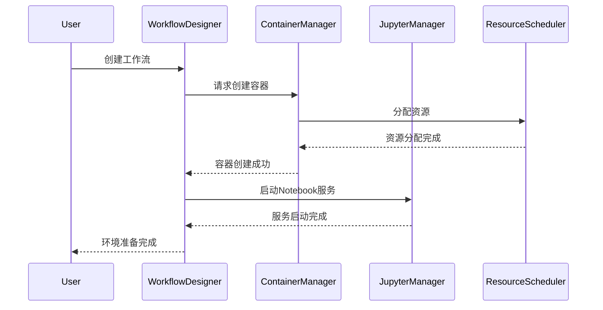

### 5.2.2 版本控制和实验追踪流程

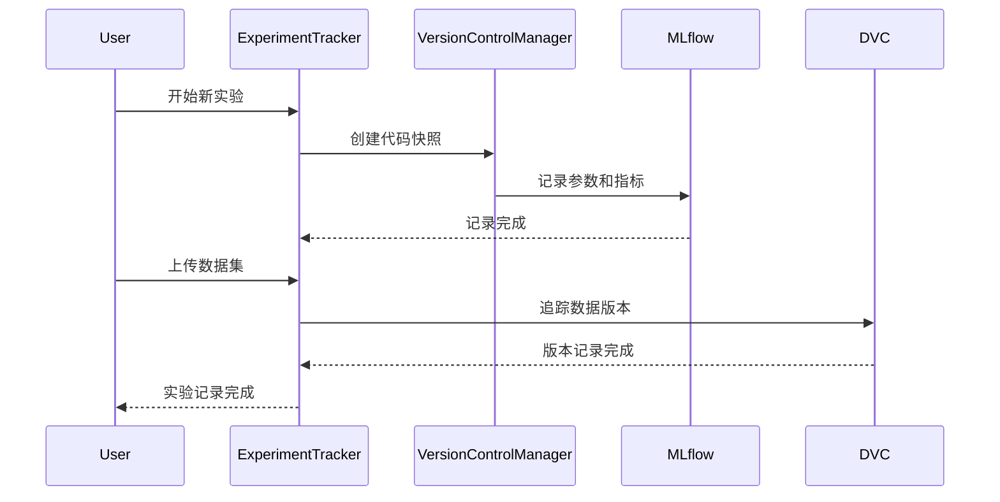

### 5.2.3 工作流执行流程

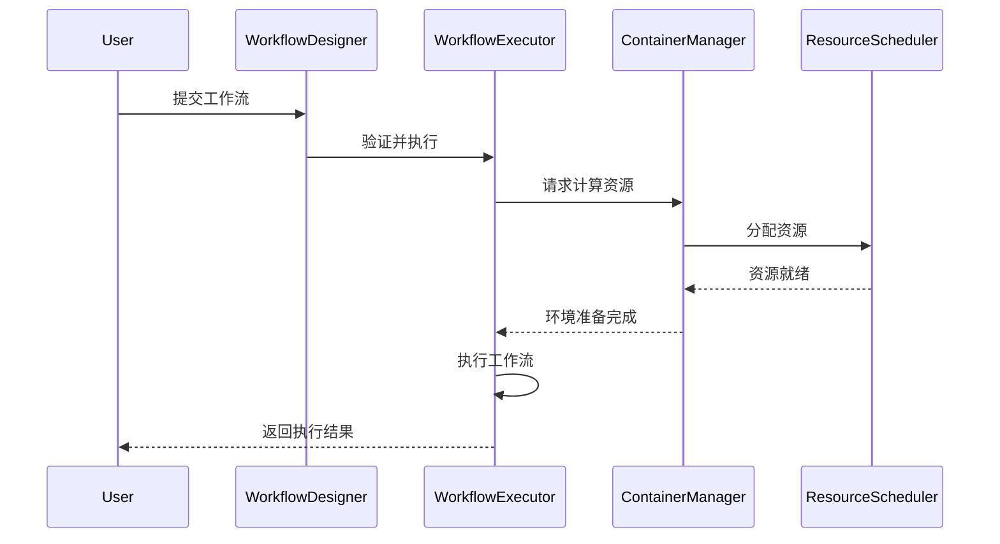

# 6 数据设计

## 6.1 数据库设计

### 6.1.1 数据库选型

1. **关系型数据库（MySQL）**
    - 用于存储结构化数据，如用户信息、系统配置、工作流定义和任务执行记录
    - 支持事务处理，确保数据一致性和完整性

2. **对象存储（MinIO）**
    - 用于存储非结构化数据，如数据集、模型文件和实验结果
    - 提供高可用性和扩展性，支持大规模数据存储

### 6.1.2 数据库结构概览

1. **用户信息表（users）**
    - `user_id`：主键，用户唯一标识
    - `username`：用户名
    - `email`：用户邮箱
    - `password_hash`：密码哈希
    - `created_at`：创建时间

2. **工作流定义表（workflows）**
    - `workflow_id`：主键，工作流唯一标识
    - `user_id`：外键，关联用户
    - `name`：工作流名称
    - `definition`：工作流定义（JSON格式）
    - `created_at`：创建时间

3. **任务执行记录表（tasks）**
    - `task_id`：主键，任务唯一标识
    - `workflow_id`：外键，关联工作流
    - `status`：任务状态（如进行中、已完成、失败）
    - `start_time`：任务开始时间
    - `end_time`：任务结束时间

4. **实验记录表（experiments）**
    - `experiment_id`：主键，实验唯一标识
    - `user_id`：外键，关联用户
    - `parameters`：实验参数（JSON格式）
    - `metrics`：实验指标（JSON格式）
    - `created_at`：创建时间

## 6.2 数据存储策略

1. **数据存储方式**
    - 结构化数据存储在MySQL中，确保数据的完整性和一致性
    - 非结构化数据存储在MinIO中，支持大文件和多版本管理

2. **数据一致性和完整性保证**
    - 使用事务机制确保关系型数据库操作的原子性
    - 定期备份数据库和对象存储，防止数据丢失
    - 实现数据校验和约束，确保数据输入的合法性

## 6.3 数据流图

### 6.3.1 数据流概述

1. **数据上传**
    - 用户通过Web界面上传数据集，系统将数据存储到MinIO中，并记录元数据到MySQL

2. **数据预处理**
    - 用户选择预处理步骤，系统在容器中执行预处理任务，生成中间数据并存储

3. **模型训练**
    - 预处理后的数据被加载到模型训练模块，系统根据用户配置启动训练任务

4. **实验记录**
    - 训练完成后，系统记录实验参数和结果到MySQL，并将模型文件存储到MinIO

5. **结果分析**
    - 用户通过Web界面查看实验结果，系统从MySQL和MinIO中加载数据进行展示

### <span style="background:rgba(240, 200, 0, 0.2)">6.3.2 数据流图示例</span>

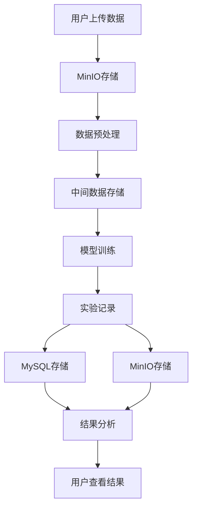

# 7 系统部署架构

## 7.1 部署环境描述

1. **硬件环境**
    - **服务器**：使用支持Docker和Kubernetes的物理服务器或云服务器
    - **存储**：配置足够的磁盘空间用于数据集、模型和日志的存储
    - **计算资源**：配备多核CPU和可选的GPU，以支持高性能计算任务

2. **软件环境**
    - **操作系统**：使用Linux（如Ubuntu 20.04或CentOS 8）
    - **容器平台**：Docker 20.10+，Kubernetes 1.23+
    - **数据库**：MySQL 8.0+或PostgreSQL 13+
    - **Web服务器**：Nginx 1.18+，用于反向代理和负载均衡

3. **网络环境**
    - **协议支持**：支持HTTPS协议，确保数据传输安全
    - **网络拓扑**：配置内部网络以支持服务间通信，使用VPC或类似技术隔离网络流量

## 7.2 服务器与网络拓扑结构

1. **服务器架构**
    - **主服务器**：负责运行核心服务，包括API网关、业务逻辑处理和数据库管理
    - **辅助服务器**：用于处理高负载任务，如模型训练和数据预处理
    - **存储服务器**：专用于数据和模型的存储，确保高可用性和数据安全

2. **网络拓扑**
    - **负载均衡器**：使用Nginx或云服务提供的负载均衡器分发流量
    - **防火墙**：配置防火墙规则，限制不必要的外部访问
    - **内部网络**：使用私有网络连接各个服务器，确保数据传输的安全性和效率

3. **安全策略**
    - **访问控制**：使用VPN或SSH密钥进行服务器访问控制
    - **数据加密**：在传输和存储过程中使用加密技术保护数据

## 7.3 容器化和虚拟化方案

1. **容器化方案**
    - **Docker**：用于应用程序的容器化，确保环境一致性和快速部署
    - **Kubernetes**：用于容器编排和管理，支持自动扩展和故障恢复

2. **虚拟化方案**
    - **虚拟机**：在需要时使用虚拟机提供额外的隔离和资源分配
    - **云服务**：利用云服务（如AWS、Azure或GCP）提供的虚拟化技术，支持弹性扩展和资源优化

3. **部署策略**
    - **CI/CD**：使用Jenkins或GitLab CI进行持续集成和持续部署，确保代码变更的快速上线
    - **蓝绿部署**：在更新时使用蓝绿部署策略，减少停机时间和风险
    - **滚动更新**：逐步更新容器实例，确保服务的连续性和稳定性

# 8 系统安全设计

## 8.1 安全需求与目标

1. **数据安全**
    - 确保用户数据的机密性和完整性
    - 防止未授权访问和数据泄露
    - 实现数据的安全备份和恢复机制

2. **访问安全**
    - 实现可靠的用户身份认证
    - 建立细粒度的权限控制机制
    - 防止未授权的资源访问

3. **环境安全**
    - 确保容器环境的隔离性
    - 限制容器资源使用
    - 防止恶意代码执行

4. **传输安全**
    - 保护数据传输的安全性
    - 防止中间人攻击
    - 确保通信内容的机密性

## 8.2 身份认证与授权机制

1. **用户认证**
    - 采用用户名密码认证
    - 支持多因素认证（可选）
    - 实现会话管理和超时机制
    - 密码强度要求和定期更新策略

2. **权限控制**
    - 基于角色的访问控制（RBAC）
    - 资源级别的权限管理
    - 最小权限原则实施
    - 权限动态调整机制

3. **会话管理**
    - 使用JWT（JSON Web Token）进行会话管理
    - 实现会话超时和自动登出
    - 防止会话固定攻击
    - 支持多设备登录控制

## 8.3 数据传输安全方案

1. **传输加密**
    - 使用HTTPS协议进行数据传输
    - 采用TLS 1.3加密标准
    - 实现端到端加密
    - 证书管理和更新机制

2. **API安全**
    - 实现API认证和授权
    - 请求签名验证
    - 防止重放攻击
    - 限制请求频率

3. **数据加密**
    - 敏感数据加密存储
    - 使用安全的加密算法（如AES-256）
    - 密钥管理和轮换机制
    - 数据脱敏处理

## 8.4 安全审计和日志记录

1. **审计日志**
    - 记录用户登录和操作行为
    - 记录系统关键事件
    - 记录安全相关事件
    - 日志的安全存储和保护

2. **监控告警**
    - 实时监控异常行为
    - 设置安全告警阈值
    - 自动告警机制
    - 安全事件响应流程

3. **日志管理**
    - 日志分类和存储策略
    - 日志查询和分析功能
    - 日志备份和归档
    - 日志保留期限设置

4. **安全合规**
    - 符合数据保护法规要求
    - 定期安全评估和审计
    - 安全策略定期更新
    - 安全事件报告机制

# 9 系统接口设计

## 9.1 内部接口设计

### 9.1.1 容器管理接口

1. **容器生命周期管理**
```python
class ContainerManager:
    def create_container(config: Dict) -> ContainerInfo:
        """创建容器
        Args:
            config: 容器配置信息，包含镜像、资源限制等
        Returns:
            ContainerInfo: 容器信息，包含ID、状态等
        """

    def start_container(container_id: str) -> bool:
        """启动容器
        Args:
            container_id: 容器ID
        Returns:
            bool: 操作是否成功
        """

    def stop_container(container_id: str) -> bool:
        """停止容器
        Args:
            container_id: 容器ID
        Returns:
            bool: 操作是否成功
        """
```

2. **资源调度接口**
```python
class ResourceScheduler:
    def allocate_resources(request: ResourceRequest) -> ResourceAllocation:
        """分配计算资源
        Args:
            request: 资源请求，包含CPU、内存等需求
        Returns:
            ResourceAllocation: 资源分配结果
        """

    def monitor_resources(container_id: str) -> ResourceMetrics:
        """监控资源使用情况
        Args:
            container_id: 容器ID
        Returns:
            ResourceMetrics: 资源使用指标
        """
```

### 9.1.2 代码执行接口

1. **Jupyter服务接口**
```python
class JupyterService:
    def start_notebook(user_id: str) -> NotebookSession:
        """启动Notebook会话
        Args:
            user_id: 用户ID
        Returns:
            NotebookSession: 会话信息
        """

    def execute_code(session_id: str, code: str) -> ExecutionResult:
        """执行代码
        Args:
            session_id: 会话ID
            code: 要执行的代码
        Returns:
            ExecutionResult: 执行结果
        """
```

### 9.1.3 版本控制接口

1. **代码版本管理**
```python
class VersionControl:
    def commit_changes(user_id: str, files: List[str], message: str) -> CommitInfo:
        """提交代码变更
        Args:
            user_id: 用户ID
            files: 变更文件列表
            message: 提交信息
        Returns:
            CommitInfo: 提交详情
        """

    def get_version_history(file_path: str) -> List[VersionInfo]:
        """获取版本历史
        Args:
            file_path: 文件路径
        Returns:
            List[VersionInfo]: 版本历史记录
        """
```

## 9.2 外部接口设计

### 9.2.1 RESTful API接口

1. **用户管理API**
```
POST /api/v1/users/register
- 功能：用户注册
- 请求体：
  {
    "username": string,
    "email": string,
    "password": string
  }
- 响应：
  {
    "user_id": string,
    "token": string
  }

POST /api/v1/users/login
- 功能：用户登录
- 请求体：
  {
    "username": string,
    "password": string
  }
- 响应：
  {
    "token": string
  }
```

2. **工作流管理API**
```
POST /api/v1/workflows
- 功能：创建工作流
- 请求体：
  {
    "name": string,
    "description": string,
    "nodes": Array<Node>,
    "connections": Array<Connection>
  }
- 响应：
  {
    "workflow_id": string
  }

GET /api/v1/workflows/{workflow_id}/status
- 功能：获取工作流状态
- 响应：
  {
    "status": string,
    "progress": number,
    "error": string?
  }
```

### 9.2.2 WebSocket接口

1. **实时日志接口**
```
WS /ws/logs/{container_id}
- 功能：接收容器日志流
- 消息格式：
  {
    "timestamp": number,
    "level": string,
    "message": string
  }
```

2. **任务状态监控接口**
```
WS /ws/tasks/{task_id}/status
- 功能：监控任务执行状态
- 消息格式：
  {
    "status": string,
    "progress": number,
    "metrics": Object
  }
```

## 9.3 API 接口定义与说明

### 9.3.1 接口规范

1. **请求格式规范**
    - 使用JSON格式进行数据交换
    - 请求头必须包含`Content-Type: application/json`
    - 认证请求需包含`Authorization: Bearer <token>`

2. **响应格式规范**
```json
{
    "code": 200,          // 状态码
    "message": "success", // 状态信息
    "data": {            // 响应数据
        // 具体数据字段
    }
}
```

3. **错误处理规范**
```json
{
    "code": 400,         // 错误码
    "message": "错误描述",
    "errors": [         // 详细错误信息
        {
            "field": "字段名",
            "message": "错误描述"
        }
    ]
}
```

### 9.3.2 接口安全规范

1. **认证要求**
    - 所有非公开API都需要进行身份认证
    - 使用JWT进行身份验证
    - Token过期时间设置为2小时

2. **访问控制**
    - 实现基于角色的访问控制
    - 对敏感操作进行权限验证
    - 记录所有API访问日志

3. **接口限流**
    - 按用户ID进行请求限流
    - 对高消耗资源的接口设置特殊限制
    - 实现优雅的限流响应机制

# 10 性能与扩展性设计

## 10.1 性能优化方案

1. **前端性能优化**
    - **代码优化**
        * 使用React.memo和useMemo避免不必要的重渲染
        * 实现组件懒加载，减少首屏加载时间
        * 使用webpack进行代码分割和压缩

    - **资源优化**
        * 使用CDN加速静态资源加载
        * 图片懒加载和适当压缩
        * 合理使用浏览器缓存

    - **交互优化**
        * 实现请求防抖和节流
        * 大数据列表虚拟滚动
        * 优化拖拽操作的性能

2. **后端性能优化**
    - **数据库优化**
        * 合理设计索引
        * 优化SQL查询语句
        * 实现分页查询
        * 定期数据清理和维护

    - **API优化**
        * 实现API响应数据压缩
        * 合理使用批量处理接口
        * 异步处理耗时操作

    - **资源利用优化**
        * 实现线程池管理
        * 优化内存使用
        * 合理配置连接池

3. **容器性能优化**
    - **资源分配优化**
        * 根据任务类型动态分配资源
        * 实现资源使用监控和自动调整
        * 优化容器启动时间

    - **任务调度优化**
        * 实现任务优先级管理
        * 合理分配计算资源
        * 优化任务排队机制

## 10.2 缓存设计

1. **多级缓存架构**
    - **浏览器缓存**
        * 静态资源缓存策略
        * LocalStorage数据缓存
        * Service Worker离线缓存

    - **应用层缓存**
        * 使用Redis缓存会话信息
        * 缓存频繁访问的数据
        * 实现缓存预热机制

    - **数据库缓存**
        * 使用MySQL查询缓存
        * 实现二级缓存
        * 定期更新缓存数据

2. **缓存策略**
    - **缓存更新策略**
        * 设置合理的过期时间
        * 实现缓存失效机制
        * 采用LRU淘汰算法

    - **缓存一致性**
        * 实现缓存同步机制
        * 处理缓存击穿问题
        * 解决缓存雪崩问题

3. **缓存监控**
    - **性能监控**
        * 监控缓存命中率
        * 监控缓存响应时间
        * 监控内存使用情况

    - **异常处理**
        * 缓存服务故障处理
        * 缓存数据恢复机制
        * 降级策略实现

## 10.3 系统可扩展性方案

1. **架构扩展性**
    - **水平扩展**
        * 支持添加更多服务器节点
        * 实现负载均衡
        * 数据分片存储

    - **垂直扩展**
        * 优化单机性能
        * 升级硬件资源
        * 改进算法实现

2. **功能扩展性**
    - **模块化设计**
        * 遵循高内聚低耦合原则
        * 支持插件式扩展
        * 预留功能扩展接口

    - **接口扩展**
        * 版本化API设计
        * 支持自定义接口
        * 兼容性处理机制

3. **容量扩展性**
    - **存储扩展**
        * 支持分布式存储
        * 实现数据分片
        * 自动扩容机制

    - **计算扩展**
        * 支持分布式计算
        * 任务并行处理
        * 资源动态调度

4. **可维护性设计**
    - **监控系统**
        * 实现性能监控
        * 资源使用监控
        * 异常监控告警

    - **运维支持**
        * 自动化部署支持
        * 配置中心设计
        * 日志收集分析

# 11 故障处理和恢复机制

## 11.1 错误处理策略

1. **异常分类与处理**
    - **系统级异常**
        * 服务器宕机
        * 网络连接中断
        * 资源耗尽
        * 数据库故障

    - **应用级异常**
        * 代码执行错误
        * 参数验证失败
        * 权限验证失败
        * 业务逻辑错误

    - **用户级异常**
        * 输入数据错误
        * 操作超时
        * 并发冲突
        * 资源访问冲突

2. **错误处理机制**
    - **异常捕获与日志记录**
        * 实现统一的异常处理中间件
        * 记录详细的错误信息和堆栈跟踪
        * 生成唯一的错误标识符
        * 区分开发环境和生产环境的错误信息

    - **错误通知机制**
        * 实时告警通知
        * 错误级别分类
        * 通知方式多样化（邮件、短信等）
        * 告警阈值设置

3. **故障隔离**
    - **服务隔离**
        * 容器级别隔离
        * 资源限制
        * 故障域划分

    - **错误传播控制**
        * 实现熔断机制
        * 服务降级策略
        * 超时控制

## 11.2 系统备份与恢复策略

1. **数据备份策略**
    - **定期备份**
        * 数据库全量备份
        * 增量备份机制
        * 自动备份调度
        * 备份数据加密存储

    - **备份内容**
        * 用户数据
        * 系统配置
        * 代码仓库
        * 容器镜像

    - **备份存储**
        * 多副本存储
        * 异地备份
        * 备份数据验证
        * 定期清理过期备份

2. **系统恢复机制**
    - **故障恢复流程**
        * 故障检测
        * 自动切换备用系统
        * 数据恢复
        * 服务重启

    - **恢复时间目标**
        * 定义RTO（恢复时间目标）
        * 定义RPO（恢复点目标）
        * 分级恢复策略
        * 恢复优先级设定

3. **容灾设计**
    - **容灾策略**
        * 主备切换机制
        * 数据同步策略
        * 服务迁移方案
        * 应急预案制定

## 11.3 异常检测与处理机制

1. **监控与检测**
    - **系统监控**
        * 服务器状态监控
        * 容器运行状态
        * 资源使用情况
        * 性能指标监控

    - **异常检测**
        * 错误日志分析
        * 性能异常检测
        * 安全威胁检测
        * 业务异常识别

2. **自动化处理**
    - **自动恢复机制**
        * 服务自动重启
        * 容器自动恢复
        * 负载自动调整
        * 资源自动扩展

    - **预防措施**
        * 健康检查
        * 容量规划
        * 性能基准测试
        * 压力测试

3. **问题诊断与分析**
    - **诊断工具**
        * 日志分析工具
        * 性能分析工具
        * 监控面板
        * 调试工具

    - **根因分析**
        * 错误模式识别
        * 影响范围评估
        * 解决方案制定
        * 复盘与总结

4. **持续改进**
    - **经验积累**
        * 建立故障知识库
        * 优化处理流程
        * 更新应急预案
        * 技术方案改进

    - **团队协作**
        * 明确责任分工
        * 建立响应机制
        * 定期演练
        * 总结复盘

# 12 开发与部署工具

## 12.1 使用的开发工具和框架

1. **开发环境**
    - **IDE和编辑器**
        * Visual Studio Code：主要代码编辑器
        * PyCharm：Python开发环境
        * Jupyter Notebook：数据分析和模型开发

    - **开发语言**
        * Python 3.8+：后端开发
        * TypeScript/JavaScript：前端开发
        * SQL：数据库操作

2. **前端框架和库**
    - **核心框架**
        * React 18.x：用户界面开发
        * TypeScript 4.x：类型系统支持
        * Ant Design：UI组件库

    - **工具库**
        * React Flow：工作流可视化
        * Axios：HTTP客户端
        * Socket.IO：WebSocket通信

3. **后端框架和工具**
    - **Web框架**
        * Django 4.x：Web应用框架
        * Django REST framework：RESTful API支持
        * Django ORM：数据库对象关系映射

    - **机器学习工具**
        * MLflow：模型生命周期管理
        * DVC：数据版本控制
        * scikit-learn：机器学习算法库

4. **数据库和存储**
    - MySQL 8.0：关系型数据库
    - Redis 6.x：缓存和会话管理
    - MinIO：对象存储服务

## 12.2 自动化部署工具

1. **容器化工具**
    - **Docker工具链**
        * Docker Engine：容器运行时
        * Docker Compose：多容器应用管理
        * Docker Registry：镜像仓库

    - **容器编排**
        * Kubernetes：容器编排平台
        * kubectl：命令行工具
        * Helm：包管理器

2. **CI/CD工具**
    - **持续集成**
        * Jenkins：自动化构建和测试
        * GitLab CI：代码集成和测试
        * GitHub Actions：自动化工作流

    - **部署工具**
        * Ansible：自动化配置管理
        * Terraform：基础设施即代码
        * Shell脚本：自动化部署脚本

3. **监控和日志工具**
    - **系统监控**
        * Prometheus：指标收集
        * Grafana：可视化监控
        * cAdvisor：容器监控

    - **日志管理**
        * ELK Stack：日志收集和分析
        * Fluentd：日志聚合
        * Kibana：日志可视化

## 12.3 代码管理和版本控制方案

1. **版本控制系统**
    - **代码版本控制**
        * Git：分布式版本控制系统
            - 使用 Git Flow 工作流管理开发流程
            - 配置 .gitignore 忽略不必要的文件
            - 使用 git hooks 进行提交前检查
        * GitHub/GitLab：代码托管平台
            - 启用 2FA 双因素认证增强安全性
            - 配置 Protected Branches 保护重要分支
            - 设置 Issue Templates 规范问题报告
        * Git LFS：大文件存储
            - 用于管理模型文件、数据集等大文件
            - 配置 .gitattributes 指定 LFS 追踪文件
            - 定期清理未使用的 LFS 对象

    - **分支策略**
        * 主分支(main/master)
            - 只接受经过充分测试的稳定代码
            - 每次合并都需要通过 CI 流水线
            - 强制要求代码审查和签名提交
        * 开发分支(develop)
            - 作为功能开发的集成分支
            - 定期同步主分支内容
            - 配置自动化测试确保基本稳定性
        * 功能分支(feature/*)
            - 命名规范：feature/功能描述-开发者
            - 完成后通过 PR 合并到 develop
            - 要求编写完整的功能测试
        * 发布分支(release/*)
            - 命名规范：release/v版本号
            - 只允许修复 bug，不接受新功能
            - 完成后同时合并到 main 和 develop
        * 修复分支(hotfix/*)
            - 命名规范：hotfix/问题描述
            - 从 main 分支创建，修复后立即合并
            - 要求编写回归测试用例

2. **代码质量管理**
    - **代码审查流程**
        * Pull Request 规范
            - 标题格式：[模块] 功能描述 (#PR号)
            - 必须包含功能说明和测试结果
            - 至少需要一位资深开发者审查通过
        * 代码审查重点
            - 代码逻辑和架构设计
            - 测试覆盖率要求(>80%)
            - 文档完整性检查
        * 自动化检查
            - PR 提交触发 CI 流水线
            - 代码风格和质量门禁检查
            - 安全漏洞扫描

    - **质量工具配置**
        * Python 代码规范
            - pylint：配置 .pylintrc 自定义规则
            - Black：设置行长度为 88 字符
            - isort：统一 import 语句排序
        * JavaScript 代码规范
            - ESLint：使用 Airbnb 规范为基础
            - Prettier：统一代码格式化配置
            - husky：配置 pre-commit 钩子
        * 测试框架
            - pytest：单元测试和集成测试
            - Jest：前端组件测试
            - Coverage.py：测试覆盖率统计

3. **文档管理系统**
    - **API 文档规范**
        * Swagger/OpenAPI
            - 实时同步更新 API 文档
            - 支持在线调试和测试
            - 导出多种格式的文档
        * Postman
            - 维护完整的 API 测试集合
            - 自动化接口测试脚本
            - 团队共享和协作功能
        * 文档编写规范
            - 统一使用 Markdown 格式
            - 包含详细的示例代码
            - 定期进行文档审查和更新

    - **项目文档体系**
        * 开发文档(GitBook)
            - 架构设计文档
            - 开发环境搭建指南
            - 编码规范和最佳实践
        * 技术文档(Sphinx)
            - 自动生成 Python API 文档
            - 集成测试报告和覆盖率报告
            - 支持多版本文档管理
        * 部署文档
            - 环境依赖清单
            - 部署步骤和检查项
            - 常见问题解决方案

# 13 系统架构图与附图

## 13.1 系统整体架构图

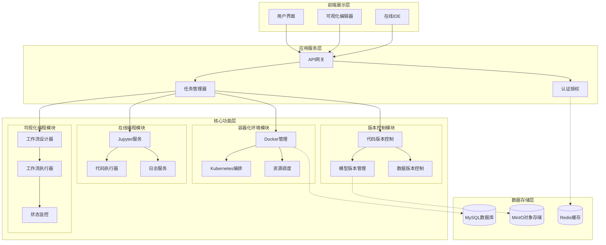

## 13.2 关键模块或子系统的详细图

### 13.2.1 容器化环境模块详细设计

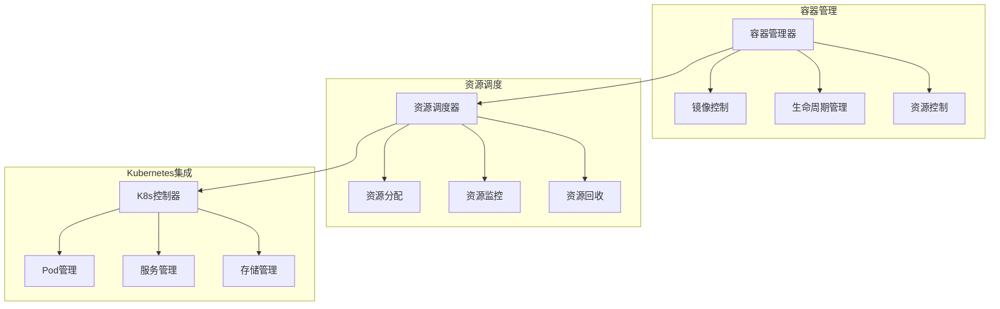

### 13.2.2 在线编程模块详细设计

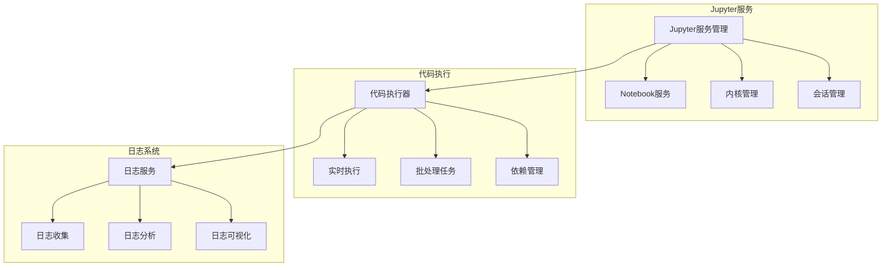

### 13.2.3 版本控制模块详细设计

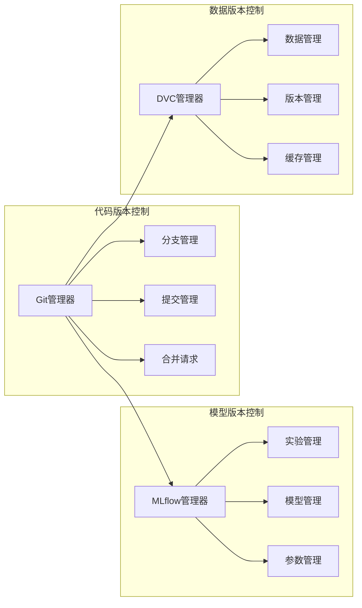

### 13.2.4 可视化编程模块详细设计

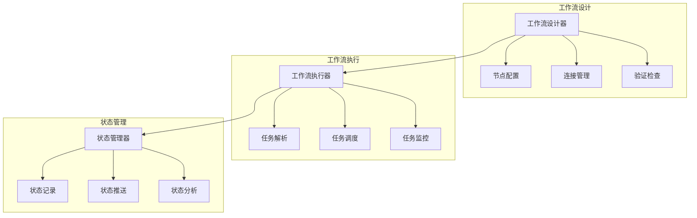

## 13.3 数据流图、状态图、时序图等

### 13.3.1 系统主要数据流图

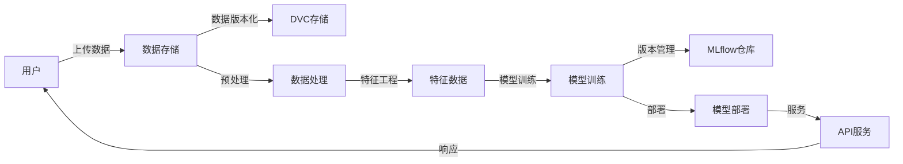

### 13.3.2 模型训练任务状态图

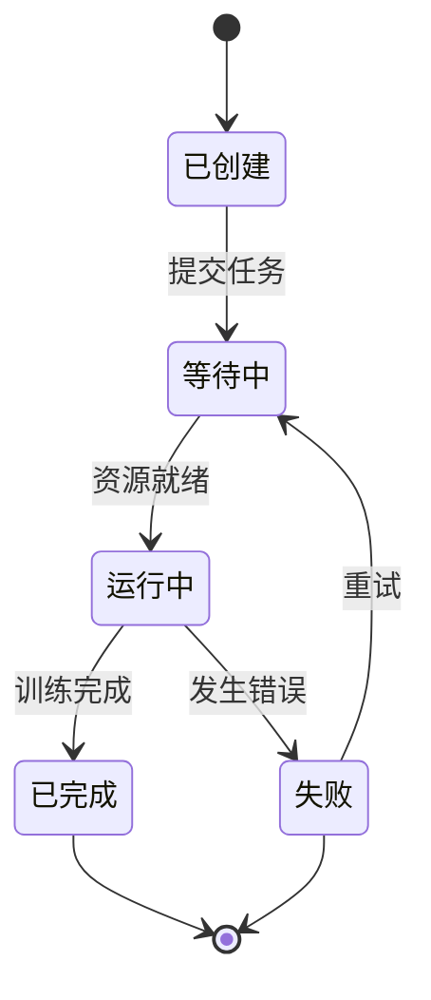

### 13.3.3 容器生命周期时序图

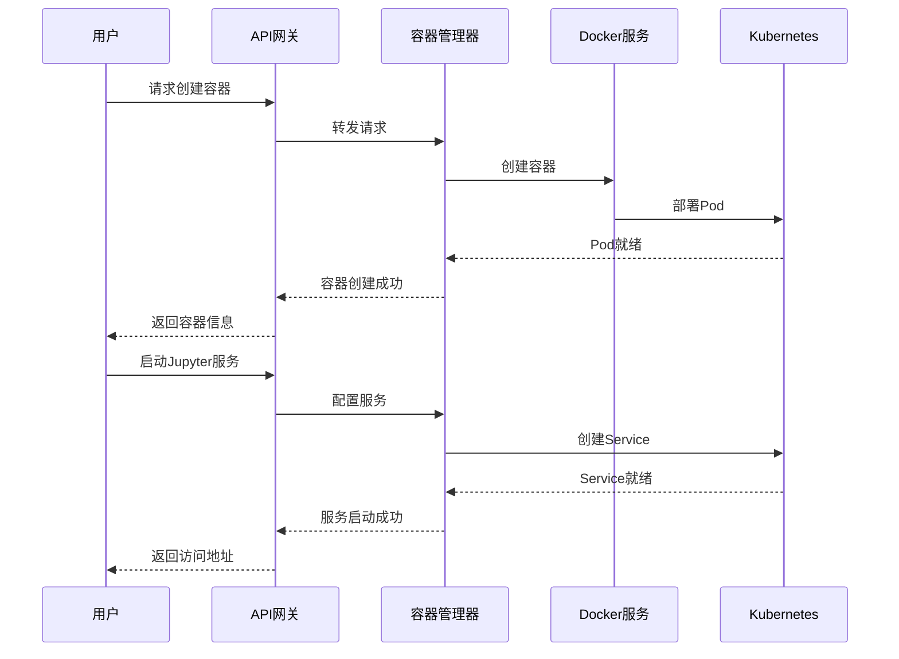

# 14 附录

## 14.1 参考文献和链接

### 14.1.1 容器化技术相关

1. Docker 官方文档
   - https://docs.docker.com/
   - 容器化技术的核心参考资料,包含安装、配置和最佳实践

2. Kubernetes 官方文档 
   - https://kubernetes.io/docs/
   - 容器编排和资源调度的主要参考

3. Minikube 文档
   - https://minikube.sigs.k8s.io/docs/
   - 本地开发环境下的轻量级 Kubernetes 实现

### 14.1.2 开发环境相关

1. Jupyter 项目文档
   - https://jupyter.org/documentation
   - 在线交互式开发环境的核心参考

2. JupyterLab 文档
   - https://jupyterlab.readthedocs.io/
   - 新一代 Jupyter 开发环境的使用指南

3. VS Code Web 文档
   - https://code.visualstudio.com/docs/remote/vscode-server
   - Web 版 VS Code 的部署和配置指南

### 14.1.3 版本控制相关

1. Git 官方文档
   - https://git-scm.com/doc
   - 代码版本控制的基础参考

2. MLflow 文档
   - https://mlflow.org/docs/latest/index.html
   - 机器学习生命周期管理工具的使用指南

3. DVC (Data Version Control) 文档
   - https://dvc.org/doc
   - 数据版本控制工具的详细说明

### 14.1.4 Web开发相关

1. Django 官方文档
   - https://docs.djangoproject.com/
   - Python Web框架的完整参考

2. React 官方文档
   - https://reactjs.org/docs/
   - 前端框架的开发指南

3. TypeScript 文档
   - https://www.typescriptlang.org/docs/
   - JavaScript的类型系统扩展

### 14.1.5 机器学习框架

1. TensorFlow 文档
   - https://www.tensorflow.org/api_docs
   - 深度学习框架的API参考

2. PyTorch 文档
   - https://pytorch.org/docs/
   - 深度学习研究平台的使用指南

3. Scikit-learn 文档
   - https://scikit-learn.org/stable/documentation.html
   - 机器学习算法库的使用说明

## 14.2 相关术语解释

1. **容器化(Containerization)**
   - 将应用程序及其依赖打包在一个独立的容器中运行的技术
   - 确保应用程序在不同环境中都能一致地运行

2. **Kubernetes (K8s)**
   - 开源的容器编排平台
   - 用于自动化部署、扩展和管理容器化应用程序

3. **Docker**
   - 开源的容器化平台
   - 用于开发、发布和运行应用程序的标准化工具

4. **Jupyter Notebook**
   - 基于Web的交互式计算环境
   - 支持实时代码执行、可视化和文档编写

5. **MLflow**
   - 机器学习生命周期管理平台
   - 用于跟踪实验、打包代码并分享模型

6. **DVC (Data Version Control)**
   - 专注于机器学习项目的版本控制工具
   - 用于管理和版本化数据集与模型

7. **API (Application Programming Interface)**
   - 应用程序编程接口
   - 定义了不同软件组件之间的交互方式

8. **CI/CD (Continuous Integration/Continuous Deployment)**
   - 持续集成/持续部署
   - 自动化软件的构建、测试和部署过程

9. **GPU (Graphics Processing Unit)**
   - 图形处理单元
   - 用于加速深度学习模型的训练和推理

10. **工作流(Workflow)**
    - 定义了一系列任务的执行顺序和依赖关系
    - 在机器学习中通常包括数据处理、模型训练等步骤

11. **REST API**
    - 表述性状态传输应用程序接口
    - 一种基于HTTP协议的API设计风格

12. **WebSocket**
    - 提供全双工通信通道的网络协议
    - 用于实现服务器和客户端之间的实时数据传输

13. **MinIO**
    - 高性能的对象存储服务
    - 用于存储非结构化数据如模型文件、数据集等

14. **Redis**
    - 开源的内存数据结构存储系统
    - 用作数据库、缓存和消息中间件

15. **Pod**
    - Kubernetes中最小的可部署单元
    - 包含一个或多个容器的集合