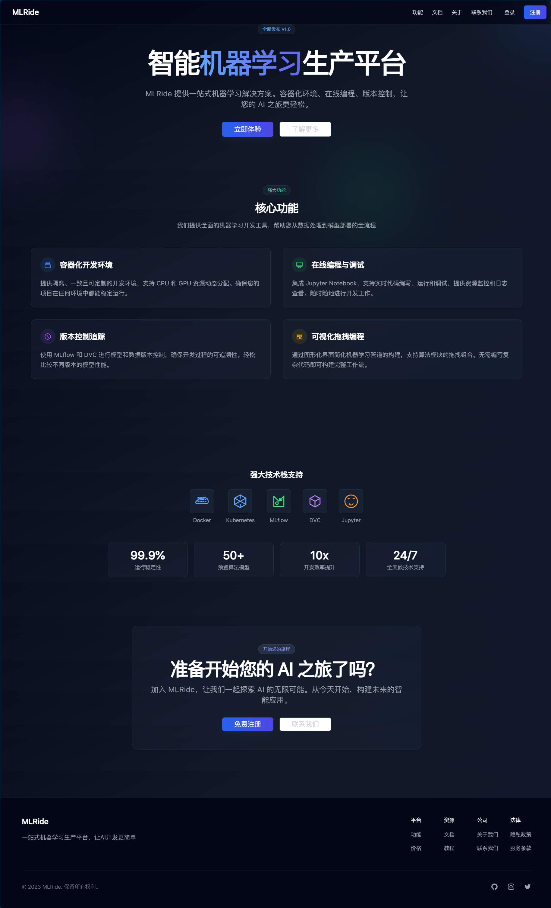

# MLRide - 机器学习生产平台

## 项目概述
MLRide是一个现代化的机器学习生产平台，旨在提供一站式的机器学习开发和部署解决方案。该平台集成了容器化开发环境、在线编程调试、版本控制追踪以及可视化拖拽编程等功能，使机器学习工作流程更加高效和便捷。

## 功能模块

### 1. 用户认证模块
- 用户注册
- 用户登录
- 用户登出
- 会话管理
- 用户个人空间（头像、昵称等）
- 用户信息修改
- 账户注销

### 2. 容器化开发环境
- Docker容器管理
- 资源分配（CPU、内存、GPU）
- 环境配置管理

### 3. 在线编程与调试
- Jupyter Notebook集成
- 实时日志查看
- 资源监控
- 动态资源分配

### 4. 版本控制追踪
- 模型版本控制（MLflow）
- 数据版本控制（DVC）
- 代码版本控制（Git）
- 可视化版本比较

### 5. 可视化拖拽编程
- 图形化工作流设计
- 预置算法组件
- 实时工作流监控
- 配置导出与复用

## 主要界面

### 1.登陆页面



### 2.登录与注册界面


### 3.仪表板页面


## 技术栈

### 后端
- Python 3.9
- Django 4.2.18
- Django REST Framework 3.15.2
- MySQL 8.0.36

### 前端
- React 19
- TypeScript 5.7.2
- Vite 6.1.0
- Ant Design 5.23.4
- Axios 1.7.9
- React Router DOM 7.1.5
- Redux Toolkit 2.5.1
- Tailwind CSS 3.4.1
- Shadcn/UI 组件库
- Radix UI

### 开发工具
- Docker
- Kubernetes
- MLflow
- DVC
- Jupyter Notebook

## 项目结构
```
MLRide/
├── backend/                # 后端项目目录
│   ├── authentication/     # 用户认证应用
│   │   ├── migrations/      # 数据库迁移文件
│   │   ├── admin.py         # 管理界面配置
│   │   ├── apps.py          # 应用配置
│   │   ├── models.py        # 数据模型
│   │   ├── serializers.py   # 序列化器
│   │   ├── urls.py         # URL路由
│   │   └── views.py         # 视图函数
│   ├── container/           # 容器管理应用
│   │   ├── migrations/      # 数据库迁移文件
│   │   ├── models.py        # 容器数据模型
│   │   ├── serializers.py  # 容器序列化器
│   │   ├── docker_ops.py    # 容器客户端，提供容器操作的高级接口
│   │   └── views.py         # 容器视图函数
│   ├── mlride/             # 项目主配置
│   │   ├── settings.py      # 项目设置
│   │   ├── urls.py         # 主路由配置
│   │   └── wsgi.py         # WSGI配置
│   ├── requirements.txt    # Python依赖清单
│   ├── manage.py           # Django管理脚本
│   └── test_api.py         # API测试脚本
├── frontend/              # 前端项目目录
│   ├── src/               # 源代码目录
│   │   ├── components/    # 可重用组件
│   │   ├── pages/         # 页面组件
│   │   ├── services/      # API服务
│   │   ├── store/         # 状态管理
│   │   ├── types/         # 类型定义
│   │   ├── styles/        # 样式文件
│   │   ├── App.tsx        # 根组件
│   │   └── main.tsx       # 入口文件
│   ├── public/            # 静态资源
│   ├── package.json       # 项目配置和依赖
│   ├── vite.config.ts     # Vite配置
│   ├── tsconfig.json      # TypeScript配置
│   └── eslint.config.js   # 代码规范检查
├── Docs/                  # 文档目录
│   ├── 需求分析.md        # 功能需求文档
│   ├── 系统架构设计.md    # 技术架构文档  
│   ├── 模块设计.md       # 模块详细设计
│   └── 开发计划.md       # 项目开发路线图
├── docker-compose.yml     # Docker编排配置
├── Dockerfile             # Docker镜像配置
└── README.md              # 项目说明文档
```

## 开发进度
- [x] 项目初始化
- [x] 数据库设计
- [x] 用户认证后端API
- [x] 前端项目搭建
- [x] API服务配置
- [ ] 用户认证组件开发
- [ ] 路由配置
- [ ] 状态管理
- [ ] 容器化环境
- [ ] 在线编程模块
- [ ] 版本控制集成
- [ ] 可视化编程界面

## 安装和运行

### 环境要求
- Python 3.9+
- Node.js 16+
- MySQL 8.0+
- Docker 20.10+
- Kubernetes 1.20+

### 后端部署
1. 克隆项目：
```bash
git clone https://github.com/yourusername/MLRide.git
cd MLRide
```

2. 创建虚拟环境：
```bash
python -m venv venv
source venv/bin/activate  # Linux/Mac
.\venv\Scripts\activate   # Windows
```

3. 安装依赖：
```bash
pip install -r requirements.txt
```

4. 配置数据库：
- 创建MySQL数据库
- 修改 backend/mlride/settings.py 中的数据库配置

5. 运行迁移：
```bash
cd backend
python manage.py makemigrations
python manage.py migrate
```

6. 创建超级用户：
```bash
python manage.py createsuperuser
```

7. 启动服务：
```bash
python manage.py runserver
```

### 前端部署
1. 进入前端目录：
```bash
cd frontend
```

2. 安装依赖：
```bash
npm install
```

3. 开发环境运行：
```bash
npm run dev
```

4. 生产环境构建：
```bash
npm run build
```

## 依赖要求

### 后端依赖
```
django==4.2.18
djangorestframework==3.15.2
django-cors-headers==4.6.0
mysqlclient==2.2.7
requests==2.32.3
python-dotenv==1.0.0
gunicorn==21.2.0
docker==7.0.0
kubernetes==29.0.0
psutil==5.9.8  # 用于系统资源监控 
```

### 前端依赖
```
react==19.0.0
typescript==5.7.2
vite==6.1.0
antd==5.23.4
axios==1.7.9
react-router-dom==7.1.5
@reduxjs/toolkit==2.5.1
react-redux==9.2.0
tailwindcss==3.4.1
@shadcn/ui==1.0.0
radix-ui==1.0.0
```

## 开发规范

### 代码风格
- Python: 遵循PEP 8规范
- JavaScript/TypeScript: 遵循Airbnb风格指南
- 使用ESLint和Prettier保持代码风格一致

### Git提交规范
- feat: 新功能
- fix: 修复bug
- docs: 文档更新
- style: 代码格式修改
- refactor: 代码重构
- test: 测试用例
- chore: 其他修改

### 分支管理
- main: 主分支，用于生产环境
- develop: 开发分支
- feature/*: 功能分支
- hotfix/*: 紧急修复分支

## 常见问题解决

### 1. 数据库连接问题
```sql
-- 检查数据库连接
SHOW PROCESSLIST;
-- 检查用户权限
SHOW GRANTS FOR 'username'@'localhost';
```

### 2. 前端开发问题
- 清除缓存：`npm cache clean --force`
- 重新安装依赖：删除node_modules并重新运行npm install
- CORS问题：检查后端CORS配置

### 3. Docker相关问题
- 查看容器日志：`docker logs container_id`
- 清理Docker缓存：`docker system prune`
- 重建容器：`docker-compose up --build`

## 项目维护

### 日常维护
1. 数据库备份
2. 日志清理
3. 性能监控
4. 安全更新

### 性能优化
1. 数据库索引优化
2. 缓存策略调整
3. 代码性能分析
4. 负载均衡配置

### 监控告警
1. 服务器监控
2. 应用性能监控
3. 错误日志监控
4. 安全漏洞监控
